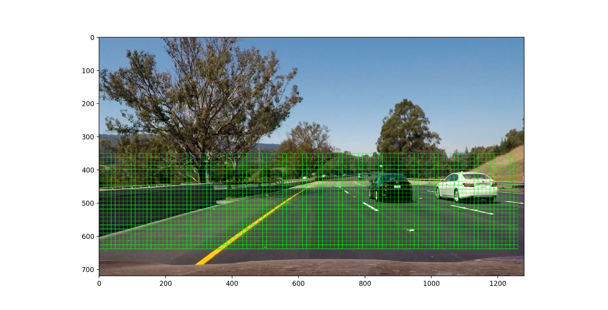
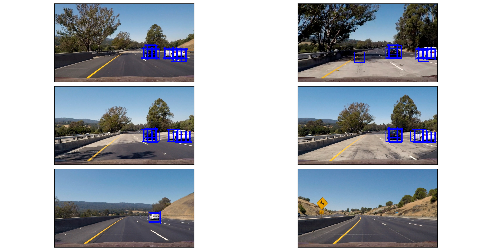
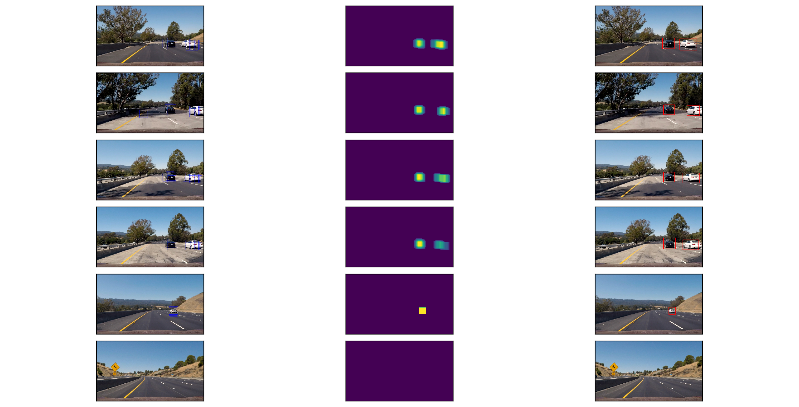

# Vehicle Detection Project

The goals / steps of this project are the following:

* Perform a Histogram of Oriented Gradients (HOG) feature extraction on a labeled training set of images and train a classifier Linear SVM classifier
* Optionally, you can also apply a color transform and append binned color features, as well as histograms of color, to your HOG feature vector. 
* Note: for those first two steps don't forget to normalize your features and randomize a selection for training and testing.
* Implement a sliding-window technique and use your trained classifier to search for vehicles in images.
* Run your pipeline on a video stream (start with the test_video.mp4 and later implement on full project_video.mp4) and create a heat map of recurring detections frame by frame to reject outliers and follow detected vehicles.
* Estimate a bounding box for vehicles detected.

[//]: # (Image References)
[image1]: ./output_images/sample.png
[image2]: ./output_images/hog_features.png
[image3]: ./examples/sliding_windows.jpg
[image4]: ./examples/sliding_window.jpg
[image5]: ./examples/bboxes_and_heat.png
[image6]: ./examples/labels_map.png
[image7]: ./examples/output_bboxes.png
[video1]: ./project_video.mp4

## Classification

### 1. Feature Extraction

The code for the feature extraction step is in [line 37-38](./fitting_pipeline.py#L37-L38) of the file [`fitting_pipeline.py`](./fitting_pipeline.py).
I decided to use a combination of spatial binning, color histogram and HOG as image features.

I  implemented the function [`extract_features()`](./features.py#L48) which takes a 64x64x3 pixel image, converts it to the given color space (here is used YCrCB )
and then applies the `bin_spatial()`, `color_hist()` and `get_hog_features()` functions to the image to create a feature vector.

### 2. Histogram of Oriented Gradients (HOG)

For the HOG feature extraction I reused the function [`get_hog_features()`](./features.py#L35) from the classroom module and explored different color spaces
and different parameters. [`get_hog_features()`](./features.py#L35) applies the `skimage.hog()` function to each color channel of the given image and concatenates the
resulting features to a single vector.

Finally I decided to use the following HOG parameters: `color_space = 'YCrCb'`, `hog_channel = 'ALL'`, `orientations=8`, `pixels_per_cell=(8, 8)` and `cells_per_block=(2, 2)`:

Here are two plots that show an example of the HOG feature extraction with the parameters described above. The first plot shows the original image and the second one shows the three color channels next to its related HOG features.

![alt text][image1]

![alt text][image2]

#### 3. Training the Classifier

I trained a linear SVM using the larger project dataset for [vehicles](https://s3.amazonaws.com/udacity-sdc/Vehicle_Tracking/vehicles.zip) and [non-vehicles](https://s3.amazonaws.com/udacity-sdc/Vehicle_Tracking/non-vehicles.zip).
The code fot the data collection, feature extraction and classifier training is in file [`fitting_pipeline.py`](./fitting_pipeline.py).

After reading in all data samples ([line 69-70](./fitting_pipeline.py#L69-L70)) each sample set (vehicles and non-vehicles) is passed to function called [`fit_model()`](./fitting_pipeline.py#L32).
First the function  does the feature extraction for all data samples as described in the section above ([line 37-38](./fitting_pipeline.py#L37-L38)).

Because the data comes without any labeling the labels are the created in [lines 45-47](./fitting_pipeline.py#L45-L47).

Before the fitting the SVM the data was split into a training (80%) and a testing (20%) subset and scaled using a StandardScaler ([lines 50-56](./fitting_pipeline.py#L50-L56))

Finally the SVM model was fit in [lines 60](./fitting_pipeline.py#L60).

The model fitting step produced the follwing outcomes:

`Feature extraction time: 155 seconds`

`Fitting time: 17 seconds`

`Model accuracy: 0.9938063063063063`

### Sliding Window Search

First I tried to use a simple sliding windows approach ([`find_cars.py` lines 43-61](./find_cars.py#L43-L61)) , where the feature extraction is calculated for each single window.
But this approach was very slow in computation.

That's why I decided to implement a Sub-sampling Window Search like introduced by the classroom module. The code for the Sub-sampling Window Search can be found in [`find_cars.py` lines 63-140](./find_cars.py#L63-L140).
The function first computes the HOG features for the entire search area of the image ([lines 95-97](./find_cars.py#L95-L97)). After this step the search area is iteratively processed by a sliding window.
For each window the features are extracted and passed to the classifiers prediction method ([lines 107-125](./find_cars.py#L107-L125)). Windows with positive predictions are stored in a list.

After some experimenting I found the follwing parameters with gave me the best detection result:

|Parameter|Value|
|:--------|----:|
|Search area in y|350px - 650px|
|Window size|96x96px (scale = 1.5)|
|Overlap in x and y|87.5% (cells_per_step=1|

The following image visualizes the search are and sliding windows on a test image with the parameters mentioned above:

The following image shows the results of the Sub-sampling Window Search on some test images with the parameters mentioned above:

---

### Video Implementation

#### 1. Video Result

The code for processing the video could be found on [`video_pipeline.py`](./video_pipeline.py).
For processing the video the pipeline (Sub-sampling Window Search and Headmap Thresholding) was used as described in the section above

Here's a [link](./videos/project_video_ouput.mp4) to my project video result.

#### 2. Final Pipeline
To combine the boxes found by the Sub-sampling Window Search and eliminate some false positives, a heat map was implemented with a threshold and
the function `label()` from `scipy.ndimage.measurements` was used to to identify individual blobs in the heatmap. I then assumed each blob corresponded to a vehicle.
I constructed bounding boxes to cover the area of each blob detected.

The code for this implementation could be found on [`image_pipeline.py` lines 21-27](./image_pipeline.py#L21-L27).

The next image shows the results of this step with the final car detection on the most right column:

---

### Discussion

As it can be seen by my [project video result](./videos/project_video_ouput.mp4) the pipeline still produces
some false positives especially in scenes with high image contrast (e.g. transition into shadow).

The false positives rate could be improved by filtering detections of each frames over time. This could be implemented
by a moving average on the heat map or by using or more advanced approach like kalman filter.

Further fine tuning the extracted features, e.g. combining different color spaces and thresholds like it was done in the advanced lane finding project,

Another drawback of the current pipeline is that it migth detect vehicles on the oncoming lanes.
To prevent this I suggest to apply a trapezial filter mask on the image to search for vehicle in right lanes only.
Doing this could also improve the performance of the pipeline, because the amount of space to search is minimized.
